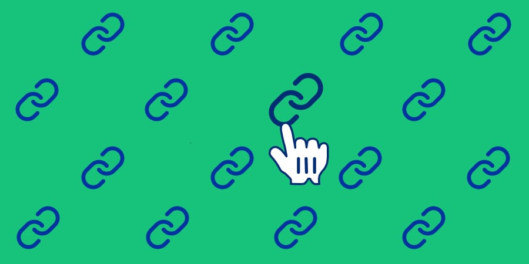

# Las URLs nos han traído hasta aquí

No han pasado tantos años desde que Tim Berners-Lee ideó un [mundo de documentos conectados](https://resilientwebdesign.com/chapter1/#hyperspace). Conforme JavaScript ganaba peso en el [desarrollo web](http://todomvc.com/), por momentos olvidamos los **cimientos de Internet: los enlaces y las URLs**. Intentaré mostrar qué ventajas tiene que volvamos a [los orígenes](http://info.cern.ch/hypertext/WWW/TheProject.html).

[](images/destacada.jpg)
<small>Imagen por Aarón García Hervás. Iconos de [Feather](https://feathericons.com/) y [cursor.in](http://cursor.in/)</small>

El **HTML no se inventó con la idea de construir complejas páginas web**, de ahí su [sencillez inicial](https://www.w3.org/History/19921103-hypertext/hypertext/WWW/MarkUp/Tags.html). Era una simple herramienta para listar enlaces a todo tipo de documentos y cada documento estaba identificado por una URL. Un concepto muy sencillo que ha permitido la construcción de un mundo conectado tal y como lo conocemos hoy en apenas unos 25 años.

Si las **URLs nos han traído hasta aquí**, ¿por qué dejar de usarlas o hacer un mal uso de ellas? Vamos a ver los problemas que han surgido en años recientes y que se han extendido como la pólvora al mismo tiempo que JavaScript ganaba terreno en la construcción de nuestras webs.

> Nota: El artículo no pretende ser una crítica a JavaScript, React o cualquier otra tecnología. Uso JavaScript a diario y me encanta, pero me gusta cuestionar las prácticas habituales y mantener las cosas lo más sencillas posible.
>
> Los ejemplos de código requiren conocimientos mínimos de React, pero los conceptos, problemas y soluciones propuestas son aplicables a cualquier web. Los bloques de código están formateados por [Prettier](https://prettier.io/).

## El problema

**JavaScript es muy poderoso**; quizás eso nos confunde y en ocasiones **le asignamos tareas que no le corresponden.** Pongamos un ejemplo. Tenemos una web cualquiera, `http://users.com`, que consiste en: un formulario de búsqueda, una tabla de resultados y unos enlaces de paginación para los resultados. Vamos a echar un vistazo al código del componente que crea uno de los enlaces de paginación:

```javascript
// Nótese la ausencia del atributo href
const paginationLink = page => <a onClick={() => showPage(page)}>{page}</a>;
```

Haciendo clic sobre este enlace la tabla de resultados cambia para mostrarnos la página correspondiente, pero la URL no cambia y sigue siendo la misma, `http://users.com`. Eso limita el rango de acción del usuario de muchas muchas maneras:

1. No podemos abrir la página en una nueva pestaña o ventana.
2. No podemos copiar, guardar o añadir la URL a nuestros marcadores.
3. No se guardará un nuevo registro en el historial de navegación.
4. No podremos escribir en la _URL bar_ del navegador para que nos autocomplete esa URL que no acabamos de recordar.
5. El _back button_ del navegador no nos servirá de nada al no haberse registrado una nueva URL en el historial.
6. No podemos hacer clic derecho para ˝Copiar enlace˝.
7. No podemos hacer clic derecho para ˝Guardar enlace como˝.

Otro ejemplo de mal uso de las URLs son los formularios de búsqueda. Seguimos con nuestra web de ejemplo `http://users.com`. Vamos a ver parte  del componente del formulario de búsqueda:

```javascript
<form
  onSubmit={event => {
    event.preventDefault();
    fetch(`http://users.com/api/search?q=${this.state.user}`)
      .then(response => response.json())
      .then(data => this.setState(() => ({ users: data })));
  }}
>
  <label>
    User name
    <input type="text" name="user" onChange={this.updateUser} />
  </label>
  <button type="submit">Search users</button>
</form>
```

En este caso al hacer submit del formulario se nos muestran los resultados de la búsqueda. Al igual que en el primer ejemplo la URL no cambia, se mantiene como `http://users.com`. Volvemos a tener algunas de las mismas pegas del primer ejemplo, concretamente de la 2 a la 5. ¿Y si nuestro usuario quiere almacenar la URL de esa búsqueda? No podrá hacerlo.

En la medida de lo posible deberíamos hacer nuestras búsquedas siempre por [GET](https://en.wikipedia.org/wiki/Hypertext_Transfer_Protocol#Request_methods). Eso hará que el usuario pueda modificar cualquiera de los parámetros de la búsqueda directamente en la URL. También facilita que puedan volver más tarde a la misma búsqueda y sepan reconocerla fácilmente por los parámetros que se encuentran en la URL.

No es lo mismo ver en la _URL bar_ de nuestro navegador `http://users.com/search` que `http://users.com/search?user=Julian+Salgado`, ¿verdad?


## Mal ejemplo

Os animo a fijaros de ahora en adelante en las webs que tengan problemas similares. Serán muchas, seguro. En las notificaciones de los productos del mismísimo Google tenemos un problema similar.

[](images/google-notificaciones.jpg)

En este caso, al hacer clic sobre una notificación, se abre una nueva pestaña con la web de destino. Por una parte usan URLs y eso es bueno, pero por alguna razón que desconozco, decidieron usar un `<div>` en vez de un enlace. La misión de los enlaces es llevarnos a otro documento (u otra parte del mismo documento). En este caso, al no ser un enlace no podemos hacer `Ctrl/Cmd + clic` ni clic derecho del ratón. Se reduce el control que el usuario tiene sobre la web.

A día de hoy los desarrolladores **[seguimos dudando entre usar `<a>` o `<button>`](https://marcysutton.com/links-vs-buttons-in-modern-web-applications/)**, pero también es un [problema generalizado en el diseño de UIs](https://medium.com/simple-human/buttons-shouldnt-have-a-hand-cursor-b11e99ca374b). Si Google usa un `<div>` como botón, ¿vamos a cuestionarlo? Sin duda.


## De parte del usuario

Os cuento una experiencia reciente. [Alex Jover](https://twitter.com/alexjoverm) y un servidor recibimos la ardua tarea de rehacer un proyecto con más de 10 años de antigüedad, llamémosle `http://legacy-app.com`. Se trataba de un gestor de usuarios, roles, perfiles, permisos, etc. desarrollado en JSP. Formularios de búsqueda, tablas de resultados con paginación y formularios de edición por doquier. El proyecto era lo suficientemente complejo como para usar un framework, y usamos React. Los usuarios finales de la aplicación iban a ser usuarios avanzados, de esos que con un teclado se bastan para navegar y rellenar formularios sin apartar la vista del monitor. En esa antigua web, todas las acciones se hacían mediante POST: búsquedas, navegación, ... de manera que la URL no se alteraba en ningún momento. A efectos prácticos era una web app dando el mismo tratamiento a las URLs que algunas de las de hoy en día, pero mucho más lenta. No podían realizar acciones tales como:

1. Abrir una página en otra pestaña o ventana.
2. Guardar en marcadores una búsqueda recurrente.
3. Buscar en el historial ese usuario que han visto hace una hora y que ya no recuerdan.
4. Escribir en la _URL bar_ y que el navegador les autocomplete.

Viendo el panorama decidimos que había que facilitar a los usuarios finales el uso de esa herramienta que durante tantas horas iban a utilizar. Diseñar la web app con las URLs en mente era una mejora exponencial en la experiencia de los usuarios finales.


## La solución

¿Cuál es la solución? Volver a los orígenes usando la **URL como _[single source of truth](https://en.wikipedia.org/wiki/Single_source_of_truth)_**. Es decir, nuestra app debe ser reactiva a los cambios en la URL cuando sea necesario. [Dan Abramov](https://twitter.com/dan_abramov/) tiene el tweet indicado para esta ocasión:

<blockquote class="twitter-tweet" data-lang="en"><p lang="en" dir="ltr">It’s also fine to switch the source of truth for something. You can start with local state, then move it into the store or into the URL bar.</p>&mdash; Dan Abramov (@dan_abramov) <a href="https://twitter.com/dan_abramov/status/727278973814771712?ref_src=twsrc%5Etfw">May 2, 2016</a></blockquote>
<script async src="//platform.twitter.com/widgets.js" charset="utf-8"></script>

No voy a mentir, no es tan sencillo como parece. **Requiere más trabajo**, pero en mi opinión **vale la pena**. Como dijo un visionario: la [URL es UI](https://www.nngroup.com/articles/url-as-ui/), y como tal la deberíamos tratar.

Vamos a una ver sencilla web app de ejemplo que he creado para la ocasión. **Podéis ver el código fuente al completo [en este CodeSandbox](https://codesandbox.io/s/73jy74j5xj)**, así como navegar por ella. Consiste en un pequeño formulario para buscar usuarios de GitHub, con paginación. El objetivo de la web app es mostrar cómo construir con React y [React Router](https://reacttraining.com/react-router/web) una búsqueda y paginación totalmente enlazable. Aunque en este ejemplo vamos a usar React Router, si lo preferís, [podéis construir vuestro propio Router](https://medium.freecodecamp.org/you-might-not-need-react-router-38673620f3d).

Usando React Router, podemos hacer que nuestros componentes [reciban por props](https://reactjs.org/docs/components-and-props.html) los datos que contiene la URL. Eso quiere decir que **podemos hacer que nuestros componentes reaccionen a los cambios en la URL**. En esta web app de ejemplo vamos a usar este acercamiento para que la URL sea quien ˝decida˝ en todo momento lo que el usuario ve en pantalla.

La estructura de carpetas es la siguiente:

```
/
|- index.js
|- components
	|- Home.js
	`- Search
		|- Search.js
		|- SearchForm.js
		|- SearchResults.js
		`- SearchPagination.js
```

A grosso modo lo que tenemos que hacer es:

1. Cuando se haga submit en el formulario de `<SearchForm>` (`SearchForm.js`), debemos construir la query string con los campos del formulario y cambiar la URL para que contenga esa query string.
2. React Router detecta el cambio de URL y nos envia por props al componente `<Search>` (`Search.js`) los nuevos valores de la query string.
3. Extraer los valores de la query string y hacer la llamada a la API para recuperar los resultados.
4. Almacenar los resultados en el estado de `<Search>`, los pasamos por props a `<SearchResults>` (`SearchResults.js`) y los mostramos en una tabla.
5. Construir los enlaces de paginación con los datos de la query string en `<SearchPagination>` (`SearchPagination.js`) y cambiar el parámetro `page` en cada uno de ellos.

Podéis ver el resultado final a continuación o si lo preferís en una [pestaña nueva](https://codesandbox.io/s/73jy74j5xj):

<iframe src="https://codesandbox.io/embed/73jy74j5xj?autoresize=1&view=preview" style="width:100%; height:500px; border:0; border-radius: 4px; overflow:hidden;" sandbox="allow-modals allow-forms allow-popups allow-scripts allow-same-origin"></iframe>

Fijaos como cambia la url cuando se hace submit del formulario o se hace click en los enlaces de paginación. Esas URLs se puede copiar, compartir, guardar, etc. Justo lo que necesitábamos.

Ahora os dejo revisar tranquilamente los ficheros clave de la app. He incrustado algunos comentarios para facilitar la comprensión. Recuerda que es mejor que tengas conocimientos mínimos de React para comprenderlo.

> Los bloques de código están acortados para facilitar la comprensión. Si quieres ver el código fuente al completo [visita este CodeSandbox](https://codesandbox.io/s/73jy74j5xj).

```javascript
// index.js

/**
 * Punto de entrada de la app.
 */
const App = () => (
  // Definimos las rutas de React Router para que nos renderice
  // el componente necesario dependiendo del path de la URL.
  <BrowserRouter>
    <div>
      <Nav />
      <Route exact path="/" component={Home} />
      <Route path="/search" component={Search} />
    </div>
  </BrowserRouter>
);
```

```javascript
// Search/Search.js

/**
 * Página de búsqueda. Se encarga de reaccionar cuando ha habido un cambio de URL.
 */
class Search extends Component {
  state = {
    user: '',
    results: [],
    total: 0,
    page: 1,
    isLoading: false
  };

  /**
   * Se ejecuta cuando el componente se monta en el DOM.
   */
  componentDidMount() {
    // Cada vez que nuestro componente se monta en el DOM debemos
    // comprobar la query string para reaccionar si ha habido cambios.
    const { user, page } = this.parseQueryString(this.props);

    if (user) {
      this.updateState({ user, page });
      this.doSearch({ user, page });
    }
  }

  /**
   * Se ejecuta cuando el componente recibe props.
   */
  componentWillReceiveProps(nextProps) {
    // Cada vez que nuestro componente recibe props debemos
    // comprobar la query string para reaccionar si ha habido cambios.
    const { user, page } = this.parseQueryString(nextProps);

    if (user) {
      this.updateState({ user, page });
      this.doSearch({ user, page });
    }
  }

  /**
   * Helper para actualizar varios campos del estado a la vez
   * desde componentes hijos.
   */  
  updateState = newValues => this.setState(() => ({ ...newValues }));

  /**
   * Recoge de la query string los parámetros de la búsqueda. 
   */
  parseQueryString = props => {
    const { location: { search } } = props;
    const queryString = qs.parse(search, { ignoreQueryPrefix: true });
    const { user, page } = queryString;

    return { user, page: parseInt(page) };
  };

  /**
   * Realiza llamada a la API y actualiza el estado con los resultados.
   */
  doSearch = ({ user, page }) => {
    this.setState({ results: [], isLoading: true });

    fetch(
      'https://api.github.com/search/users' +
        `?q=${user}+in:login&per_page=${perPage}&page=${page}`
    )
      .then(response => response.json())
      .then(data => {
        ...
      });

    return false;
  };

  render() {
    const { user, results, total, page, isLoading } = this.state;

    // Cargamos los 3 subcomponentes necesarios: formulario,
    // tabla de resultados y paginación.
    return (
      <div>
        <h1>Search users</h1>
        <SearchForm
          user={user}
          isLoading={isLoading}
          updateState={this.updateState}
        />
        <SearchResults results={results} isLoading={isLoading} />
        {!isLoading &&
        total > 0 && <SearchPagination total={total} page={page} />}
      </div>
    );
  }
}
```

```javascript
// Search/SearchForm.js

/**
 * Formulario con un campo de texto para escribir login de usuario de GitHub.
 */
class SearchForm extends Component {
  /**
   * Actualiza nombre de usuario en el estado.
   */
  updateUser = event => {
    const { updateState } = this.props;
    const { value: user } = event.target;

    updateState({ user });
  };

  /**
   * Controla el submit del formulario.
   */
  onSubmit = event => {
    event.preventDefault();

    const { user, location, location: { search }, history } = this.props;
    const queryParams = qs.parse(search, { ignoreQueryPrefix: true });

    // Construimos la query string y usamos ˝history˝ que nos
    // provee React Router para actualizar la URL.
    history.push({
      pathname: location.pathname,
      search: qs.stringify({ ...queryParams, user, page: 1 })
    });
  };

  render() {
    const { user, isLoading } = this.props;

    return (
      <form
        onSubmit={this.onSubmit}
        method="GET"
        acceptCharset="utf-8"
      >
        <label>
          User name
          <input
            type="text"
            name="user"
            placeholder="Write a GitHub user name"
            value={user || ''}
            onChange={this.updateUser}
          />
        </label>
        <button type="submit" disabled={isLoading || !user}>
          Find users
        </button>
      </form>
    );
  }
}
```

```javascript
// Search/SearchPagination.js

/**
 * Devuelve un array con los enlaces de paginación.
 */
const buildLinks = (totalPages, page, pathname, queryParams) => {
  const links = [];

  // Cada enlace debe tener la misma query string exceptuando ˝page˝.
  for (let i = 1; i <= totalPages; i++) {
    const search = qs.stringify({ ...queryParams, page: i });

    links.push(
      <Link
        key={i}
        to={{
          pathname,
          search
        }}
        style={i === page ? stylesLinkSelected : stylesLink}
      >
        {i}
      </Link>
    );
  }

  return links;
};

/**
 * Paginación de resultados.
 */
const SearchPagination = ({
  total = 0,
  page = 1,
  location: { pathname, search }
}) => {
  // Calcular número total de páginas.
  const totalPages = Math.ceil(total / perPage);
  // Recoger parámetros de la query string
  const queryParams = qs.parse(search, { ignoreQueryPrefix: true });
  const links = buildLinks(totalPagesToRender, page, pathname, queryParams);

  // Si no hay más de 1 página no mostramos la paginación.
  if (totalPages < 2) {
    return null;
  }

  return (
    <div>
      {links}
    </div>
  );
};
```


## Conclusiones

Hemos roto el ⬅ _back button_ de nuestro navegador y costará arreglarlo. ¿Pasará lo mismo con el ↻ _refresh button_? Os miro a vosotros [service workers](https://gist.github.com/Rich-Harris/fd6c3c73e6e707e312d7c5d7d0f3b2f9#reloading-the-page-doesnt-behave-as-youd-expect).

<blockquote class="twitter-tweet" data-lang="es"><p lang="en" dir="ltr">With single page apps, we broke the back button. Now, thanks to the power of service workers, we&#39;ve broken the refresh button.</p>&mdash; Mark Dalgleish (@markdalgleish) <a href="https://twitter.com/markdalgleish/status/921515267804487680?ref_src=twsrc%5Etfw">20 de octubre de 2017</a></blockquote>
<script async src="//platform.twitter.com/widgets.js" charset="utf-8"></script>


**Las URLs** nos han traído hasta aquí, y no parece que vayan a irse pronto: **cumplen su cometido a la perfección y no vamos a encontrar un sustituto**. Si a nuestros usuarios les proveemos de acciones vinculadas a URLs, le damos la posibilidad de volver a realizar esas acciones de una manera mucho más rápida. Al mismo tiempo le damos libertad para que pueda elegir cómo y cuándo realizar esas acciones: abrir un enlace en una nueva pestaña, guardar un enlace desde el móvil para verlo más tarde desde su sobremesa, escribir en la _URL bar_ para que el navagador le ayude a recordar, volver a entrar en nuestra web una semana después desde el historial, etc.

La próxima vez que estés desarrollando o diseñando una funcionalidad web, pregúntate a ti mismo si hacer esa funcionalidad dependiente de la URL puede ayudar a tus usuarios.

Y recuerda que **sin las URLs no hubieramos llegado tan lejos**.


#### Referencias y lecturas recomendadas
- [URLs are UI](https://www.hanselman.com/blog/URLsAreUI.aspx) por [Scott Hanselman](https://twitter.com/shanselman)
- [URL as UI](https://www.nngroup.com/articles/url-as-ui/) por [Jakob Nielsen](https://en.wikipedia.org/wiki/Jakob_Nielsen_(usability_consultant))
- [Resilient Web Design](https://resilientwebdesign.com/) por [Jeremy Keith](https://twitter.com/adactio)
- [Links vs. Buttons in Modern Web Applications](https://marcysutton.com/links-vs-buttons-in-modern-web-applications/) por [Marcy Sutton](https://twitter.com/marcysutton)
- [Buttons shouldn’t have a hand cursor](https://medium.com/simple-human/buttons-shouldnt-have-a-hand-cursor-b11e99ca374b) por [Adam Silver](https://twitter.com/adambsilver)
- [But sometimes links look like buttons (and buttons look like links)](https://medium.com/simple-human/but-sometimes-links-look-like-buttons-and-buttons-look-like-links-9b371c57b3d2) por [Adam Silver](https://twitter.com/adambsilver)


#### Agradecimientos
Este post está dedicado a [Alex Jover](https://twitter.com/alexjoverm), mi compañero de trabajo durante los últimos meses y compinche de aventuras en [Alicante Frontend](https://alicantefrontend.es). ¡Se te echa de menos!


#### Autor
[](images/aaron-garcia-hervas.jpg)

**Aarón García Hervás**

Marido, padre y Front-end Developer, por ese orden. Actualmente en [Hawkers](https://www.hawkersco.com/). Disfruto coorganizando [Alicante Frontend](https://alicantefrontend.es), compartiendo en [Twitter](https://twitter.com/aarongarciah) y colaborando en [GitHub](https://github.com/aarongarciah). Lo bueno y breve.

[@aarongarciah](https://twitter.com/aarongarciah)

[aarongarciah.com](https://aarongarciah.com)

