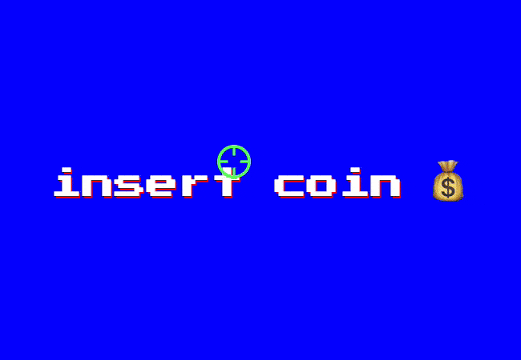
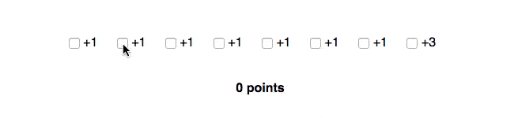
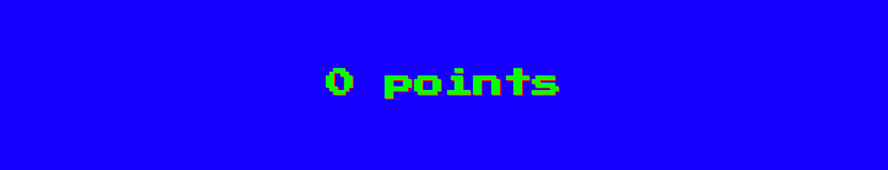
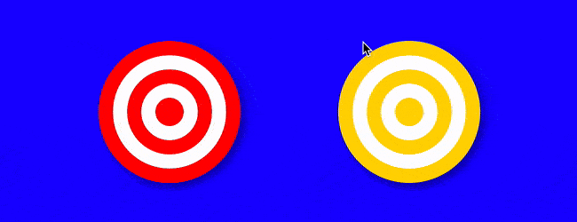
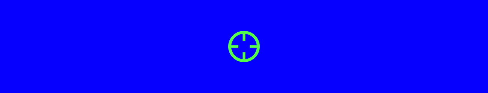
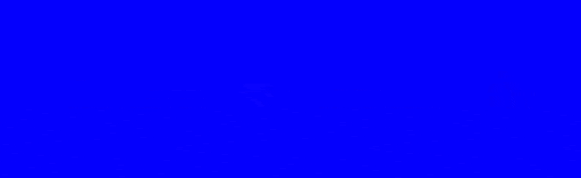

# 🎯 HTML + CSS dan mucho juego

CSS nos permite construir cosas extremadamente complejas con [un puñado de caracteres](https://codepen.io/aarongarciah/pen/ePOpxy). El lenguaje [ha crecido mucho](https://twitter.com/meyerweb/status/929097712754098181) con los años y el abanico de posibilidades que nos brinda es enorme. Haciendo uso de algunas técnicas conocidas, y otras no tanto, vamos a construir un juego únicamente con HTML y CSS. ¿Lo conseguiremos sin JavaScript? Spoiler: sí.

## ¿Qué vamos a hacer?

Vamos a construir un **juego en el que dispararemos a dianas móviles haciendo uso únicamente de HTML y CSS**. No vamos a hacer uso de preprocesadores ni de sistemas de nomenclatura CSS como BEM. Con ello pretendemos que el proceso más entendible. Sí haremos uso de _[Custom properties](https://developer.mozilla.org/en-US/docs/Web/CSS/--*)_ (aka _CSS Variables_), por lo que si no estáis familiarizados con ellas os recomiendo [una lectura rápida en MDN](https://developer.mozilla.org/en-US/docs/Web/CSS/--*).

El resultado final será este:



> Nota: el juego será compatible con casi todos los navegadores, excepto Internet Explorer y Opera Mini. Si no usáramos _Custom properties_ el juego sería compatible incluso con Internet Explorer 9.

Lo primero que veremos en el juego es la pantalla de inicio que evita que el juego empiece hasta que hagamos clic. Una vez hagamos clic unas dianas caerán del cielo y deberemos ser certeros con nuestros disparos para alcanzar cuantas más mejor. Un contador irá sumando nuestros aciertos; 1 punto por cada diana. Además, incluiremos una diana especial que sumará 3 puntos. Cuando hayan caído todas las dianas, se mostrará en grande el marcador final.

Si eres un desarrollador de los que no toca CSS ni con un palo, estarás flipando, pero **no hay trazas de JavaScript en el juego** que vamos a construir. Palabra de honor.

Vamos a ir explicando paso a paso el proceso para hacerlo más entendible. En cada paso veremos sólo el código relevante para ese paso e incluiremos un enlace a CodePen donde se podrá ver y probar el juego en cada una de las fases.

¡Comenzamos!

## 1. Contador de puntos



Lo primero que vamos a hacer es el contador de puntos. Aunque no muy usados, existen los _**[CSS counters](https://developer.mozilla.org/en-US/docs/Web/CSS/CSS_Lists_and_Counters/Using_CSS_counters)**_. Como su nombre indica, nos **permite incrementar o decrementar cierto contador definido en nuestro CSS**. Su uso es muy sencillo:

- Con la propiedad `counter-reset: points [value]` definimos o reiniciamos nuestro contador con nombre _points_. Podemos pasarle un segundo valor opcional que define el valor inicial del contador. En este caso no se lo vamos a pasar ya que queremos que sea 0. Construyendo el juego he comprobado que esta propiedad no es necesaria para definir el contador a 0, pero lo vamos a hacer por si algún navegador se queja.
- La propiedad `counter-increment: points [value]` incrementa o decrementa el contador _points_. Por defecto suma 1, pero le podemos pasar opcionalmente un segundo valor que puede ser cualquier número entero positivo o negativo.
- La función `counter()` pinta el valor del contador. Tiene una limitación muy grande y es que sólo puede ser usada en la propiedad `content` de los pseudo elementos `:before` y `:after`. A nosotros nos vale.

El principal uso que se nos viene a la cabeza para los contadores CSS son [las listas ordenadas](https://developer.mozilla.org/en-US/docs/Web/CSS/CSS_Lists_and_Counters/Using_CSS_counters). En nuestro caso cada diana será un checkbox con un label asociado y el contador nos va a servir para contar el número de aciertos, o lo que es lo mismo, el número de checkbox con su estado `:checked`.

El HTML es muy sencillo. Tenemos 8 checkbox (`.bullseye-input`) con sus respectivos labels asociados (`.bullseye`) y un párrafo que es el marcador encargado de mostrar la puntuación (`#score`), todo ello englobado en un div (`#stage`). Al último checkbox y su respectivo label le añadimos la clase _special_ para poder darle estilos diferentes y asignarle un número de puntos distinto.

```html
<div id="stage">
  <input class="bullseye-input" id="b1" type="checkbox" />
  <label class="bullseye" for="b1">Shoot me!</label>
  ...
  <input class="bullseye-input special" id="b8" type="checkbox" />
  <label class="bullseye special" for="b8"></label>

  <p id="score">points</p>
</div>
```

> Nota: no envolvemos el input con el label (con lo que nos ahorraríamos los atributos `id` y `for`) ya que después debemos hacer uso del _[adjacent sibling combinator](https://developer.mozilla.org/en-US/docs/Web/CSS/Adjacent_sibling_selectors)_ (`+`) y para ello input y label deben estar al mismo nivel.

En cuanto al CSS para el contador, primero definimos las variables con los puntos que sumará cada diana así como los puntos de las dianas especiales.

```css
:root {
  /* Variables encargadas de sumar y mostrar los puntos de las dianas normales y especiales. */
  --bullseye-points: 1;
  --bullseye-points-str: "1";
  --bullseye-special-points: 3;
  --bullseye-special-points-str: "3";

  /* Inicializamos el contador de puntos a 0. */
  counter-reset: points;
}
```

> Nota: el selector [`:root`](https://developer.mozilla.org/en-US/docs/Web/CSS/:root) equivale al elemento `html`. Definimos una variable con el valor de tipo numérico (`--bullseye-points`) y otra variable con el valor de tipo string (`--bullseye-points-str`). Esto es debido a que no hay conversión de tipos en CSS, por lo que si necesitamos mostrar el valor de una variable en un pseudo elemento mediante la propiedad `content`, que sólo acepta variables de tipo string, no podemos hacerlo con una variable de tipo numérico.

Vamos a definir el funcionamiento de los contadores. Se incrementará el contador _points_ cuando el jugador haga clic sobre un label que al estar asociado a un checkbox, lo marcará como `:checked`.

```css
/* Incrementamos el valor del contador en tantos puntos como hayamos definido
 * en nuestra variable cuando el checkbox está marcado.
 */
.bullseye-input:checked {
  --points: var(--bullseye-points);
  counter-increment: points var(--points);
}

/* Cuando la diana es especial, sobreescribimos el número puntos a sumar en el contador. */
.bullseye-input.special:checked {
  --points: var(--bullseye-special-points);
}
```

Mostramos el número de puntos en cada diana. Este es el "+1" que aparece al acertar una diana. Más adelante le daremos estilos ya que por defecto deberá estar oculto.

```css
/* Mostramos el número de puntos en el :after de la diana. */
.bullseye:after {
  --points-str: var(--bullseye-points-str);
  content: "+" var(--points-str);
}

/* Cuando la diana es especial, sobreescribimos los puntos a mostrar en el :after de la diana. */
.bullseye.special:after {
  --points-str: var(--bullseye-special-points-str);
}
```

Por último, mostramos en el pseudo elemento `:before` del marcador los puntos acumulados por el jugador.

```css
/* Mostramos el número de puntos en el marcador. */
#score:before {
  content: counter(points);
}
```

Y con esto, ya tenemos nuestro contador de puntos 😁.

[Prueba y mira el código del paso 1 en CodePen ↗️](https://codepen.io/aarongarciah/pen/WgWOMJ?editors=1100)

## 2. Estilos generales



Vamos a añadir unos cuantos estilos para darle un estilo retro al juego. La fuente seleccionada es la _[Press Start 2P](https://fonts.google.com/specimen/Press+Start+2P)_ con efecto pixelado. Ponemos un color de fondo azul y añadimos estilos para el contador posicionándolo en la parte baja del viewport. Añadimos los colores como variables para que sea más fácil la personalización del juego. Podemos usar este bloque de definición de variables a modo de configuración del juego si nos apetece cambiar cualquier cosa rápidamente sin tener que indagar en el código 😁.

```css
@import url('https://fonts.googleapis.com/css?family=Press+Start+2P')

:root {
  ...
  -bg-color: blue;-bg-color-bg-color-bg-color-bg-color
  --text-color: white;--text-color--text-color--text-color
  --accent-color: lime;--accent-color--accent-color
  ...
}

body {
  /* Evitamos que las dianas provoquen la aparición de la barra de scroll cuando están fuera del viewport. */
  overflow: hidden;

  /* Nuestra querida fuente retro. */
  font-family: 'Press Start 2P', sans-serif;
  color: var(--text-color);
  background-color: var(--bg-color);

  /* Evitamos que el usuario seleccione partes de la web sin querer mientras hace clic con el ratón. */
  user-select: none;
}

#score {
  /* Posicionamos el marcador en la parte baja del viewport. */
  position: absolute;
  bottom: 2rem;
  left: 0;
  right: 0;
  color: var(--accent-color);

  /* Añadimos una sombra retro. */
  text-shadow: 2px 2px 0px red;

  /* Permitimos que el jugador pueda hacer clic sobre una diana que está pasando por debajo del contador. */
  pointer-events: none;
}
```

> Nota: [`pointer-events`](https://developer.mozilla.org/en-US/docs/Web/CSS/pointer-events) nos permite cancelar/habilitar los eventos de punteros sobre elementos HTML y SVG. Es [muy potente](https://codepen.io/MartijnCuppens/pen/MBjqbM).

[Prueba y mira el código del paso 2 en CodePen ↗️](https://codepen.io/aarongarciah/pen/PdgjxO?editors=1100)

## 3. Estilo de las dianas



Vamos a darle un **aspecto clásico a nuestras dianas** con círculos concéntricos rojos y blancos. En el caso de las dianas especiales, el rojo lo sustituimos por un dorado. Lo hacemos con el maravilloso `radial-gradient`. Definimos unas cuantas variables con el tamaño de las dianas, tamaño de su sombra y los colores de las mismas.

```css
:root {
  ...
  --bullseye-size: 7rem;--bullseye-size--bullseye-size--bullseye-size--bullseye-size
  --bullseye-shadow-size: 1rem;--bullseye-shadow-size--bullseye-shadow-size--bullseye-shadow-size
  --bullseye-total-size: calc(var(--bullseye-size) + var(--bullseye-shadow-size) * 2);--bullseye-total-size--bullseye-total-size
  --bullseye-color: red;--bullseye-color
  --bullseye-special-color: gold;
  ...
}
```

Ocultamos los checkbox y damos estilo a la diana en sí, que es el pseudo elemento `:before` de `.bullseye`. Cuando el jugador acierta a darle a la diana, cambiamos el color de rojo (o dorado en caso de las dianas especiales) a gris y le añadimos una animación para que desaparezca quitándole la opacidad.

```css
/* Ocultamos los checkbox. */
.bullseye-input {
  ...
  opacity: 0;opacityopacityopacityopacity
}

.bullseye {
  ...
  /* Cambiamos el position para posicionar absolutamente los pseudo elementos. */
  position: relative;positionpositionpositionposition
}

.bullseye-input:checked + .bullseye {
  /* Cuando una diana se ha marcado, ya no permitimos que se desmarque. */
  pointer-events: none;
}

/* El pseudo elemento :before es la diana. */
.bullseye:before {
  /* Definimos la variable que dará el color al radial-gradient. */
  --color: var(--bullseye-color);
  content: '';

  /* Definimos el tamaño de las dianas */
  width: var(--bullseye-size);
  height: var(--bullseye-size);

  /* Hacemos la diana circular. */
  border-radius: 50%;

  /* Definimos el radial-gradient con el color que le hemos especificado. */
  background-image: radial-gradient(closest-side, var(--color) 20%, white 0, white 40%, var(--color) 0, var(--color) 60%, white 0, white 80%, var(--color) 0);
  box-shadow: 4px 4px var(--bullseye-shadow-size) rgba(0, 0, 0, 0.4);
}

.bullseye.special:before {
  /* En las dianas especiales sobreescribimos el color que se usa en el radial-gradient. */
  --color: var(--bullseye-special-color);
}

/* Cuando hemos acertado sobre una diana, cambiamos el color del radial-gradient
 * a grey, hacemos que desaparezca con opacity y disminuimos un poco su tamaño
 * con una animación.
 */
.bullseye-input:checked + .bullseye:before {
  --color: grey;
  animation: bullseye-fadeout 0.8s ease-in-out forwards;
}
```

La técnica de ocultar el checkbox y dar estilos al label [data del 2010](https://www.thecssninja.com/css/custom-inputs-using-css) y más tarde se bautizó como _Checkbox Hack_. En el post original Ryan Seddon explica cómo aplicar reglas CSS dependiendo de si un checkbox está marcado o no. Para saber si un checkbox está marcado mediante CSS, hacemos uso del pseudo selector `:checked` y si lo combinamos con selectores como `+` (_[adjacent sibling combinator](https://developer.mozilla.org/en-US/docs/Web/CSS/Adjacent_sibling_selectors)_) o `~` (_[general sibling combinator](https://developer.mozilla.org/en-US/docs/Web/CSS/General_sibling_selectors)_) podemos aplicar estilos a otros elementos que compartan padre con nuestro input. Posibilidades infinitas.

> Si estamos jugando, casi todo vale; si vamos a hacer cosas serias y queremos cuidar la accesibilidad, el _Checkbox hack_ [quizás no sea la mejor opción](https://inclusive-components.design/menus-menu-buttons/#theopenmethod).

Ahora damos estilos al "+1" que aparece cuando el usuario acierta sobre una diana, que es el pseudo elemento `:after` de `.bullseye`. Por defecto el `:after` está oculto y se muestra cuando el usuario acierta sobre la diana.

```css
/* El pseudo elemento :after es el "+1" que aparece cuando acertamos en una diana. */
.bullseye:after {
  /* Creamos una variable con los puntos a mostrar. */
  --points-str: var(--bullseye-points-str);

  /* Mostramos el número de puntos que corresponden a esta diana. */
  content: "+" var(--points);

  /* Posicionamos el elemento en el centro de la diana. */
  position: absolute;
  top: 50%;
  left: 50%;
  transform: translate(-50%, -50%);

  /* Le añadimos una sombra molona. */
  text-shadow: 2px 2px 0px var(--accent-color);
}

/* Cuando es una diana especial sobreescribimos los puntos a mostrar. */
.bullseye.special:after {
  --points-str: var(--bullseye-special-points-str);
}

/* Cuando el jugador acierta sobre una diana, le añadimos una animación para que aparezca el "+1". */
.bullseye-input:checked + .bullseye:after {
  animation: points-up 1.5s forwards;
}
```

Ya tenemos nuestras dianas molonas 😁.

[Prueba y mira el código del paso 3 en CodePen ↗️](https://codepen.io/aarongarciah/pen/GXmdQQ?editors=1100)

## 4. Animación de las dianas

Cuando el juego empiece, **las dianas deben empezar a caer** una detrás de otra. Para ello necesitamos posicionar las dianas fuera del viewport por arriba y **añadirles una animación para que caigan** cruzando el viewport hasta desaparecer por abajo. Cada diana debe tener un retraso con respecto a la anterior. Una vez hayan caído todas las dianas, animaremos el marcador de puntos hasta el centro de la pantalla para que el jugador sepa que la partida ha terminado.

Definimos 3 variables:

- El número de dianas (8). Si cambiamos este valor debemos cambiar el número de dianas en el HTML.
- La duración de la animación de caída de las dianas.
- El _delay_ o retraso que deberemos aplicar a las dianas. Esto es multiplicar el número de dianas por la duración de la animación de las dianas.

```css
:root {
  --total-bullseye: 8;
  --bullseye-animation-duration: 2.7s;
  --score-delay: calc(
    var(--bullseye-animation-duration) * var(--total-bullseye)
  );
}
```

Posicionamos las dianas fuera del viewport por la parte de arriba. Y le añadimos la animación.

```css
.bullseye {
  ...
  position: absolute;positionpositionpositionposition
  top: calc(-1 * var(--bullseye-total-size));toptoptop

  /* He preferido poner las propiedades de animation por separado para mayor claridad. */
  animation-name: bullseye-movement;animation-nameanimation-name
  animation-timing-function: ease-out;animation-timing-function
  animation-duration: var(--bullseye-animation-duration);

  /* Añadimos un delay a la animación de cada diana correspondiente a su índice multiplicado
   * por la duración de la animación de caída.
   *
   */
  animation-delay: calc(var(--bullseye-animation-duration) * (var(--index) - 1));
}

/* Definimos la variable índice de cada diana y le asignamos una posición arbitraria
 * para dar una sensación de aleatoriedad.
 */
.bullseye:nth-of-type(1) {
  --index: 1;
  left: 70%;
}
...
.bullseye:nth-of-type(8) {
  --index: 8;
  left: 85%;
}

/* Cuando el jugador acierte en la diana, paramos la animación de caída manera que se
 * quede parada. Esto sumado al afecto fadeout que le hemos añadido antes dá un efecto molón.
 */
.bullseye-input:checked + .bullseye {
  animation-play-state: paused;
  ...
}

/* Añadimos la animación al marcador. Nótese el delay que hemos calculado
 * en el bloque de variables. Importante añadir forwards para que la animación
 * se quede en su estado final al acabar.
 */
#score {
  ...
  animation: score-end 0.4s ease-in-out var(--score-delay) forwards;animationanimationanimationanimation
}
```

Ya tenemos nuestro juego casi terminado. Un par de detalles más y lo tenemos.

[Prueba y mira el código del paso 4 en CodePen ↗️](https://codepen.io/aarongarciah/pen/GXLEXE?editors=1100)

## 5. Cursor personalizado



Como todo buen juego de disparos, no podemos dejar de tener nuestra **arma con mira telescópica**. Para ello, vamos a definir la propiedad [`cursor`](https://developer.mozilla.org/en-US/docs/Web/CSS/cursor) con un SVG como [data URI](https://developer.mozilla.org/en-US/docs/Web/HTTP/Basics_of_HTTP/Data_URIs). Ni siquiera hace falta codificarlo en base 64, tan sólo necesitamos sustituir algunos caracteres especiales como "#" por "%23" y listo. Tener el SVG _inline_ nos permite cambiar el color desde el mismo código CSS sin tener que generar una nueva imagen. _Awesome_.

El centro del cursor por defecto está en la posición `0 0`. Si no cambiamos esto, queda muy raro ya que nuestra mira de sniper está descentrada 😕. Por suerte la propiedad `cursor` nos permite indicar indicar el centro de nuestro cursor personalizado. Como nuestro SVG tiene unas dimensiones de 42x42 píxeles, en nuestro caso el centro corresponden a las coordenadas `21 21`.

Además añadimos como _fallback_ el cursor `crosshair`, bastante apropiado por si algún navegador no soporta SVG como data URI.

```css
:root {
  ...
  /* Definimos nuestro cursor apuntando a una imagen con la función url(), tal y como
   * haríamos en background-image. Antes del SVG añadimos "data:image/svg+xml;utf8,"
   * para que el navegador sepa que se trata de una imagen de tipo SVG.
   */
  cursor: url('data:image/svg+xml;utf8,<svg ... fill="%2353FF45"/></svg>')
      21 21, crosshair;cursorcursorcursorcursor
}

*,
*:before,
*:after {
  /* Hacemos que todos los elementos hereden el cursor que hemos definido.
   * Si no lo hiciéramos, los <label> seguirían teniendo el cursor por defecto.
   */
  cursor: inherit;
}
```

[Prueba y mira el código del paso 5 en CodePen ↗️](https://codepen.io/aarongarciah/pen/XPwGWE?editors=1100)

## 6. Pantalla de inicio



Para **evitar que el juego empiece nada más cargar**, vamos a **añadir una pantalla de inicio**. El juego comenzará cuando el usuario haga clic sobre esta pantalla.

Añadimos un enlace con el atributo `href="#stage"`. "stage" es el id que tiene el div que engloba todo el HTML del juego. El resto del HTML continúa igual.

```html
<div id="stage">
  ...
  <a id="start" href="#stage">
    <span class="start-text">
      insert coin<span class="start-emoji">💰</span>
    </span>
  </a>
</div>
```

Ahora hacemos que `#start` ocupe toda la pantalla y le añadimos un color de fondo para que no se vea que hay detrás. Para conseguir que la animación de las dianas no empiece hasta que el usuario haga clic, vamos a hacer uso de la pseudo clase [`:target`](https://developer.mozilla.org/en-US/docs/Web/CSS/:target). Es uno de esas pseudo clases poco usadas y muy útiles. Nos permite añadir estilos al elemento que tiene el id que coincide con el hash de la URL del navegador. Por ejemplo, si estamos en una página http://www.example.com/index.html y tenemos el siguiente código:

```html
<div id="search"></div>
```

```css
#search {
  background-color: red;
}

#search:target {
  background-color: blue;
}
```

El elemento `#search` tendrá el color de fondo azul cuando la URL sea http://www.example.com/index.html#search. Esta pseudo clase nos da posibilidades casi infinitas. Podríamos hacer diferentes pantallas haciendo uso de esta técnica, de manera que cada pantalla se activara cuando se hiciera clic en el enlace correspondiente 😁. Pero vamos a simplificar, que se nos alarga.

Las animaciones de las dianas y del marcador las vamos a hacer dependientes de si el usuario ha hecho clic en `#start`, como se ve a continuación.

```css
/* El enlace de empezar partida hacemos que ocupe toda la pantalla. */
#start {
  position: fixed;
  top: 0;
  right: 0;
  bottom: 0;
  left: 0;
  ...
  color: var(--text-color);colorcolorcolorcolor
  text-shadow: 2px 2px 0 red;text-shadowtext-shadowtext-shadow
  background-color: var(--bg-color);background-colorbackground-color
}

/* Cuando el jugador hace clic en el enlace ocultamos el enlace para mostrar el juego. */
#stage:target #start {
  display: none;
}

/* Animamos el texto de #start con un efecto de pulso. */
.start-text {
  animation: pulse 1.2s ease-out infinite;
}

/* Activamos la animación de las dianas cuando el jugador ha hecho clic en #start. Empieza el juego. */
#stage:target .bullseye {
  animation-name: bullseye-movement;
}

/* Activamos la animación del marcador cuando el jugador ha hecho clic en #start. */
#stage:target #score {
  animation: score-end 0.4s ease-in-out var(--score-delay) forwards;
}
```

> Nota: podríamos conseguir lo mismo usando un checkbox con su label asociado en vez de un enlace y la pseudo clase `:target` pero de esta manera aprendemos una técnica más.

**¡Y con esto damos por finalizado [nuestro juego](https://codepen.io/aarongarciah/pen/BOEZvY?editors=1100)!** 🎉

[Prueba y mira el código final CodePen ↗️](https://codepen.io/aarongarciah/pen/BOEZvY?editors=1100)

## Conclusión

El juego lo podríamos complicar todo lo que quisiéramos:

- Que las dianas aparecieran por diferentes partes del viewport, no sólo desde arriba.
- Añadir diferentes pantallas o niveles y que las dianas fueran cada vez más rápido.
- Que cada diana tuviera una velocidad o easing diferente.
- Añadir un botón de reiniciar partida.
- Añadir música con un elemento `<audio>`.

Esto nos da una idea de las cosas que podemos llegar a hacer "únicamente" con HTML y CSS. _Respect_.

Hacer este tipo de juegos a modo de ejercicio abre la mente, despierta la creatividad y ayuda a asentar conceptos. Este juego hace uso de: Custom properties, CSS Counters, Checkbox hack, cursor personalizado, animaciones, `radial-gradient`, `:target`, etc.

Aunque esto es un juego, no es ninguna broma 😁.

### Referencias y lecturas recomendadas

- [Colección con todos los pasos en CodePen](https://codepen.io/collection/XEmvPv/), por un servidor.
- [Using CSS counters](https://developer.mozilla.org/en-US/docs/Web/CSS/CSS_Lists_and_Counters/Using_CSS_counters), documentación en MDN.
- [Custom radio and checkbox inputs using CSS](https://www.thecssninja.com/css/custom-inputs-using-css), artículo de [Ryan Seddon](https://ryanseddon.com/).
- [Stuff you can do with the “Checkbox Hack”](https://css-tricks.com/the-checkbox-hack/), artículo de [Chris Coyier](https://chriscoyier.net/) en CSS Tricks.
- [:target selector](https://developer.mozilla.org/en-US/docs/Web/CSS/:target), documentación en MDN.
- [On :target](https://css-tricks.com/on-target/), artículo de [Chris Coyier](https://chriscoyier.net/) en CSS Tricks.
- [Pure CSS Games with Counter-Increment](https://una.im/css-games/#%F0%9F%92%81), artículo de [Una Kravets](https://una.im/).
- [CSS Variable Secrets](https://youtu.be/UQRSaG1hQ20), charla de [Lea Verou](http://lea.verou.me/).

### Agradecimientos

Gracias a [Alvaro Yuste](https://twitter.com/AlvYuste), [Alex Jover](https://twitter.com/alexjoverm) y [Paco Segovia](https://twitter.com/SeGo) por su revisión y feedback ☺️.
